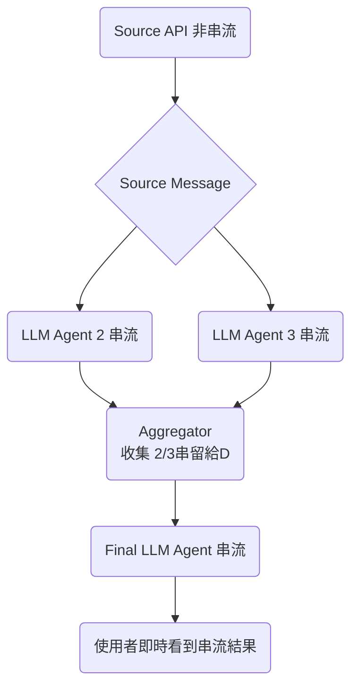

```mermaid
flowchart TD
    A(Source API 非串流) --> B{Source Message}
    B --> C1(LLM Agent 2 串流)
    B --> C2(LLM Agent 3 串流)
    C1 --> D(Aggregator\n收集 2/3串留給D)
    C2 --> D
    D --> E(Final LLM Agent 串流)
    E --> F(使用者即時看到串流結果)
```
