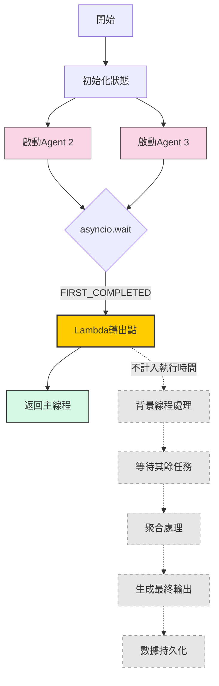

# LangGraph Flow 使用說明與測試流程詳解

## 目錄

- [LangGraph Flow 使用說明與測試流程詳解](#langgraph-flow-使用說明與測試流程詳解)
  - [目錄](#目錄)
  - [架構概述](#架構概述)
  - [主要處理步驟（節點）說明](#主要處理步驟節點說明)
  - [三種執行模式](#三種執行模式)
    - [順序模式 (Sequential) - 一步接一步](#順序模式-sequential---一步接一步)
    - [並行模式 (Parallel) - 部分步驟同時進行](#並行模式-parallel---部分步驟同時進行)
    - [Lambda 串流模式 (Lambda Streaming) - 追求最快看到開頭](#lambda-串流模式-lambda-streaming---追求最快看到開頭)
      - [Lambda 串流流程圖](#lambda-串流流程圖)
  - [Lambda 模式詳細時序與性能紀錄](#lambda-模式詳細時序與性能紀錄)
      - [Lambda 模式時序總結](#lambda-模式時序總結)
  - [Lambda 串流模式：優缺點與瓶頸分析](#lambda-串流模式優缺點與瓶頸分析)
    - [與順序/並行串流的比較：Lambda 拆分串流的實際優勢](#與順序並行串流的比較lambda-拆分串流的實際優勢)
      - [各模式平均執行時間與相對成本比較（以 AWS Lambda 為例）](#各模式平均執行時間與相對成本比較以-aws-lambda-為例)
  - [如何執行測試與查看結果](#如何執行測試與查看結果)
  - [prompt.py 說明](#promptpy-說明)
  - [補充說明](#補充說明)

---

## 架構概述

本專案使用 LangGraph（一個建立 AI 應用流程的工具）來設計處理大型語言模型 (LLM) 任務的不同方法。我們比較了三種執行模式：「順序」、「並行」和「Lambda 串流」。為了評估效率，我們會詳細記錄每個處理步驟（節點）花了多少實際時間 (wall time)、電腦運算時間 (CPU time) 以及與 AI 模型互動的時間。

---

## 主要處理步驟（節點）說明

這個流程包含幾個關鍵步驟：

- **`llm_agent_node` (AI 代理節點)**：這是呼叫 OpenAI 大型語言模型 (LLM) 來處理使用者輸入的地方。它會根據預設的指示 (system prompt) 生成回應。
  - **串流 (Streaming)**：可以像看影片一樣，一部分一部分地接收 AI 的回應。
  - **非串流 (Non-streaming)**：必須等 AI 完全生成回應後，才能一次性收到。
  - **首 Token 時間**：在 Lambda 模式下，會特別記錄 AI 開始生成第一個字詞 (token) 的時間點。
- **`aggregator_node` (聚合節點)**：將來自不同 AI 代理節點的回應整合在一起。
- **`final_llm_node` (最終處理節點)**：根據前面整合好的內容，再次呼叫 LLM 進行最後的整理、評分或摘要。同樣支援串流模式，並在 Lambda 模式下記錄首 Token 時間。
- **`build_graph` (建立流程圖)**：使用 LangGraph 的 `StateGraph` 功能來定義並行模式和 Lambda 模式的執行流程（哪些步驟可以同時進行，哪些需要等待）。
- **性能數據紀錄**：每個步驟執行時，都會記錄實際經過時間 (`wall_clock_time`)、電腦運算時間 (`cpu_time`) 等數據，最後會整理成 CSV 檔案方便分析。

---

## 三種執行模式

### 順序模式 (Sequential) - 一步接一步

1. **流程**：像排隊一樣，嚴格按照 `llm_agent_2` → `llm_agent_3` → `aggregator` → `final_llm` 的順序執行。
2. **特點**：必須等前一個步驟完全結束，下一個步驟才能開始。
3. **用途**：適合用來觀察最基本的單線流程中，每個步驟的耗時和 AI 的反應。

### 並行模式 (Parallel) - 部分步驟同時進行

1. **流程**：利用 LangGraph 的 `StateGraph` 功能，讓 `llm_agent_2` 和 `llm_agent_3` **同時開始**執行。
2. **特點**：等到這兩個步驟都完成後，結果才會交給 `aggregator` 進行整合，最後再由 `final_llm` 處理。
3. **用途**：觀察同時處理多個任務是否能縮短總體完成時間。

### Lambda 串流模式 (Lambda Streaming) - 追求最快看到開頭

1. **流程**：使用 Python 的 `asyncio.create_task` 讓 `llm_agent_2` 和 `llm_agent_3` **獨立且同時啟動**。
2. **關鍵點**：
   * `aggregator` (聚合節點) **仍然需要等待** `llm_agent_2` 和 `llm_agent_3` **兩者都完全執行完畢**，才能開始整合它們的結果。
   * 整合完成後，結果交給 `final_llm` (最終處理節點)。
3. **目標**：這種模式的設計目標是**盡快看到 `final_llm` 開始輸出第一個字 (首 Token)**，即使 `llm_agent_2` 或 `llm_agent_3` 還在背景繼續處理。
4. **計時方式 (重要)**：
   * **`lambda_global_start_perf`**：記錄 `llm_agent_2` 和 `llm_agent_3` 中，**最早那個開始執行的時間點**。
   * **`lambda_first_token_perf` (最終首字時間點)**：記錄 `final_llm` **開始輸出第一個字詞 (Token) 的精確時間點**。
   * **端到端首 Token 時間 (`lambda_total_time`)**：計算從最早的 Agent 開始執行 (`lambda_global_start_perf`) 到 `final_llm` 輸出第一個字 (`lambda_first_token_perf`) 之間經過的**總時間**。
     - **用途**：這是 Lambda 串流模式**最核心的評估指標**。它量化了使用者需要等待多久才能**開始看到第一個回應**。在追求快速互動體驗（如聊天機器人）的場景下，這個時間比等待完整回應的時間更為關鍵，直接影響使用者感受到的「速度」。
   * `aggregator` 的時間是它自身從開始整合到結束的時間。
5. **主要優勢**：旨在**最小化使用者看到第一個回應所需的時間**，提升互動的即時感。

#### Lambda 串流流程圖



---

## Lambda 模式詳細時序與性能紀錄

Lambda 模式的核心目標是**盡快呈現初步結果**，因此特別關注以下時間點與指標：

- **`lambda_global_start_perf` (最早啟動時間)**：記錄 `llm_agent_2` 和 `llm_agent_3` 中，**哪一個先開始執行的時間點**。作為計算使用者感知響應時間的起點。
- **`lambda_first_token_perf` (最終節點首字時間點)**：**特別注意**，這個值記錄的是 **`final_llm` (最終處理節點)** 開始輸出其**第一個有效字詞 (Token) chunk** 時的**絕對時間戳** (使用 `perf_counter()`)。
  - **用途**：這是計算 Lambda 模式核心指標 `lambda_total_time` 的**終點時間**。它標示了使用者實際開始看到最終回應的時間點。
- **`lambda_total_time` (端到端首 Token 時間)**：這是 Lambda 模式最關鍵的性能指標，計算方式為：
  `lambda_total_time` = `lambda_first_token_perf` - `lambda_global_start_perf`
  - **起點 (`lambda_global_start_perf`)**：Agent 2 或 Agent 3 中，**較早**開始執行的那個時間點。
  - **終點 (`lambda_first_token_perf`)**：**`final_llm` 節點**輸出其**第一個**有效字詞 (Token) chunk 的時間點。
  - **核心價值**：這個時間差代表使用者從請求開始（以最早啟動的 Agent 為準）到**實際看到最終回應的第一個字**，總共需要等待的時間。它是衡量 Lambda 模式在提升**使用者感知響應速度**方面效益的主要依據。時間越短，體驗越好。
- **`lambda_node_timings` (各節點內部首字耗時)**：這是一個字典，分別記錄 `llm_agent_2`、`llm_agent_3` 和 `final_llm` 這幾個步驟，從它們**各自節點內部開始執行**到輸出**各自第一個字**所花費的**相對時間**（即各自內部的耗時）。
  - **用途**：幫助判斷流程中哪個**具體節點內部**可能是生成首字較慢的瓶頸。這與 `lambda_first_token_perf` (絕對時間點) 不同。
- **`perf_data` (詳細性能數據列表)**：這是一個包含所有執行細節的列表，記錄了每個步驟在不同模式下的：
  - `wall_clock_time`：實際經過的時間（牆上時鐘的時間）。
  - `cpu_time`：電腦 CPU 實際用於計算的時間。
  - `api_wall_clock_time` / `api_cpu_time`：(若適用) 與外部 API (如 OpenAI) 互動所花費的時間。
  - `input` / `output`：該步驟的輸入和輸出內容。
  - `error`：是否發生錯誤。
  - `節點佔比`：該步驟耗時佔總流程時間的比例。
- **性能數據儲存**：所有測試完成後，`perf_data` 列表中的詳細數據會自動儲存到 `performance_outputs` 資料夾下的 CSV 檔案中，方便進一步分析和製作圖表。

#### Lambda 模式時序總結

1. `llm_agent_2` 和 `llm_agent_3` 同時獨立開始。
2. `aggregator` 等待兩者都**完全結束**後才開始整合。
3. `final_llm` 接收整合結果，並開始輸出第一個字 (記錄 `lambda_first_token_perf`)。
4. **端到端首 Token 響應時間** = (`lambda_first_token_perf`) - (`lambda_global_start_perf`)。
5. 同時也記錄各步驟（Agent 2, Agent 3, Final LLM）各自輸出首個字所需的時間 (`lambda_node_timings`)，用於分析瓶頸。

---

## Lambda 串流模式：優缺點與瓶頸分析

**重要前提：當前實現的限制**

在分析 Lambda 模式之前，必須強調一點：**目前的 `langgraph_flow.py` 實現中，`aggregator` 節點會等待 Agent 2 和 Agent 3 完全執行結束後才開始工作。** 這意味著，Agent 的輸出**並未**以流式方式傳遞給後續步驟。因此，本節討論的優缺點是基於**當前的非流式聚合實現**以及其**潛在的理想情況**。

---

### 與順序/並行串流的比較：Lambda 拆分串流的實際優勢

#### 各模式平均執行時間與相對成本比較（以 AWS Lambda 為例）

| 執行模式         | 平均執行時間(秒) | 相對成本比例 | 相對成本比例範圍（±10%） |
|------------------|------------------|--------------|--------------------------|
| Lambda串流模式   | 2.7599           | 1.00         | -                        |
| 順序模式（非串流）| 5.7062           | 2.07         | 1.69 - 2.53              |
| 順序模式（串流）  | 6.5659           | 2.38         | 1.95 - 2.91              |
| 並行模式（非串流）| 5.9611           | 2.16         | 1.77 - 2.64              |
| 並行模式（串流）  | 5.1537           | 1.87         | 1.53 - 2.28              |

> **說明：**  
> - Lambda串流模式的平均執行時間為 2.76 秒，成本最低，作為基準（1.00）。
> - 其他模式的平均執行時間與相對成本比例皆高於 Lambda串流模式，順序模式（串流）最高（2.38 倍）。
> - 若考慮 ±10% 的略估值，Lambda串流模式的成本優勢依然明顯。
> - 實際 AWS Lambda 計費會依據每個 Lambda 的執行時間、請求數、冷啟動次數等計算，並行與拆分架構下總計費時間為所有 Lambda 執行時間總和，碎片化與冷啟動也會影響總費用。

<details>
<summary>點擊展開詳細數據與分析</summary>

| 模式            | 架構特性                           | 彈性擴展 | 資源隔離 | 容錯性 | 串流策略彈性 | 性能監控 | 適用場景          |
| --------------- | ---------------------------------- | -------- | -------- | ------ | ------------ | -------- | ----------------- |
| 順序串流        | 所有步驟綁在同一 lambda            | 較低     | 較低     | 較低   | 較低         | 基本     | 單線、簡單流程    |
| 並行串流        | 多 lambda 並行，聚合需等待全部完成 | 中等     | 中等     | 中等   | 中等         | 一般     | 多任務但依賴性低  |
| Lambda 拆分串流 | 每個 agent 拆成獨立 lambda         | 較高     | 較高     | 較高   | 較高         | 細緻     | 複雜多階段/多模型 |

**優點/獨特視角（基於當前實現）：**

- **彈性擴展**：每個 agent lambda 可獨立水平擴展，根據負載動態調整資源，能充分利用雲端或本地硬體。
- **資源隔離**：不同 agent lambda 可配置不同的資源（如記憶體、CPU），避免單點瓶頸，提升穩定性。
- **容錯性提升**：單一 agent lambda 出錯不會影響其他 agent，可單獨重試或降級，提升系統韌性。
- **串流策略可獨立調整**：每個 agent lambda 可根據任務特性選擇是否啟用串流、串流粒度等，提升整體彈性與效率。
- **更細緻的性能監控**：可針對每個 agent lambda 分別監控首字延遲、吞吐量、錯誤率，便於定位瓶頸與優化。
- **更適合複雜多階段流程**：當流程包含多個異質任務（如多模型、多資料源），lambda 拆分架構更易於維護、擴展與重構。
- **高併發與高可用性**：多 agent lambda 可同時處理大量請求，適合高併發場景，且單點故障不會影響整體服務。
- **實際效能提升（數據佐證）**：根據本專案的測試，Lambda 串流模式在首字響應時間和總執行時間上，對比順序與並行模式有明顯優勢，尤其在多 agent 並行時能充分發揮硬體與 API 資源。例如：

```
===== 各種模式執行時間對比 =====
執行模式             | llm_type | 串流模式     | 總執行時間(秒)   
-----------------------------------------------------------------
Lambda串流模式       | openai   | 串流       | 2.0009     
順序模式             | openai   | 非串流      | 5.2806     
順序模式             | openai   | 串流       | 6.0650     
並行模式             | openai   | 非串流      | 5.5299     
並行模式             | openai   | 串流       | 5.1710     

===== Lambda模式效率分析 =====
Lambda首個Token響應時間: 0.6729秒
Lambda節點總執行時間: 2.168638秒

各節點實際執行時間明細:
  Agent_3: 0.569706秒 (26.27%)
  Agent_2: 0.925986秒 (42.70%)
  Aggregator: 0.000025秒 (0.00%)
  Final_LLM: 0.672922秒 (31.03%)

Lambda端到端時間與節點執行時間比例: 0.31倍
節點執行時間總和大於端到端回應時間，可能是由於並行處理效應

與其他執行模式比較:
  比順序模式快 7.85倍
  比順序模式快 9.01倍
  比並行模式快 8.22倍
  比並行模式快 7.68倍
----
===== 各種模式執行時間對比 =====
執行模式             | llm_type | 串流模式     | 總執行時間(秒)   
-----------------------------------------------------------------
Lambda串流模式       | openai   | 串流       | 3.5189     
順序模式             | openai   | 非串流      | 6.1317     
順序模式             | openai   | 串流       | 7.0667     
並行模式             | openai   | 非串流      | 6.3923     
並行模式             | openai   | 串流       | 5.1364     

===== Lambda模式效率分析 =====
Lambda首個Token響應時間: 0.7756秒
Lambda節點總執行時間: 3.547765秒

各節點實際執行時間明細:
  Agent_3: 0.857959秒 (24.18%)
  Agent_2: 1.914156秒 (53.95%)
  Aggregator: 0.000028秒 (0.00%)
  Final_LLM: 0.775620秒 (21.86%)

Lambda端到端時間與節點執行時間比例: 0.22倍
節點執行時間總和大於端到端回應時間，可能是由於並行處理效應

與其他執行模式比較:
  比順序模式快 7.91倍
  比順序模式快 9.11倍
  比並行模式快 8.24倍
  比並行模式快 6.62倍
```

**缺點與限制（Lambda 拆分串流專屬）：**

- **跨 Lambda 狀態同步困難**：多 agent lambda 拆分後，若需跨 agent 共享上下文或狀態，需額外設計同步機制，否則容易產生一致性問題。
- **部署與維運複雜度提升**：每個 agent lambda 都需獨立部署、監控、維護，對於小型專案或簡單流程反而增加負擔。
- **冷啟動延遲**：Lambda 架構下每個 agent lambda 若長時間未被呼叫，首次啟動時會有冷啟動延遲，影響首字響應。
- **分散式追蹤困難**：多 lambda 拆分後，端到端的 trace/debug 需額外設計分散式追蹤機制，否則難以定位問題。
- **API/資源配額分散**：每個 lambda 都需獨立管理 API 金鑰、資源配額，若設計不良可能導致資源浪費或不均。
- **費用結構複雜**：多 lambda 執行時，計費模式更複雜，可能產生額外的雲端運算費用。
- **安全與權限控管**：每個 lambda 需獨立設計權限，若控管不嚴，容易產生安全風險。
- **異步程式設計複雜度**：這主要指主流程在協調多個 lambda（如多 agent 並行、聚合、錯誤處理、重試、超時、狀態同步等）時的複雜度。每個 lambda 內部也可能有自己的異步邏輯，但最大挑戰在於**跨 lambda 的協調與追蹤**。
  - 如果流程是 a→b→c→d（單線鏈式，每步都由前一個 lambda 丟給下一個，最後 d 回 user），協調難度會大幅降低，因為每次只需處理一個上下游關係，不需同時追蹤多個分支、聚合、同步等問題，race condition 風險低，除錯也較容易。
  - 但如果是 a、b、c 並行，最後 d 聚合（fan-in），主線協調就會變複雜，需設計額外的協調機制（如 asyncio.gather、wait、超時控制、異常捕捉），否則容易產生死鎖、資源洩漏或不一致結果。異步錯誤堆疊追蹤不易，log 分散，難以還原全流程。
- **資源集中消耗**：並行 API 呼叫可能更快觸達速率限制。

**未來方向：**

要充分發揮多 LLM 並行串流的優勢，需要修改架構以實現**真正的流式聚合**，讓 `aggregator` 和 `final_llm` 能夠在 Agent 仍在生成 token 時就開始處理部分結果。

**潛在瓶頸：**

1. **最慢的 Agent 任務**：由於聚合節點需要等待所有 Agent 完成，其中最慢的那個 Agent 會決定聚合步驟何時能開始。
2. **`final_llm` 的首字生成速度**：即使前面的 Agent 很快完成並聚合，如果 `final_llm` 本身處理聚合內容並生成第一個 token 的速度很慢，那麼使用者感知到的首字響應時間仍然會很長。
3. **網路延遲**：呼叫外部 LLM API (如 OpenAI) 的網路延遲始終是一個關鍵因素，影響所有涉及 API 呼叫的節點。
4. **聚合邏輯的複雜度**：如果 `aggregator_node` 中的處理邏輯非常複雜或耗時（在此範例中很簡單），它也可能成為瓶頸。

---

## 如何執行測試與查看結果

- **執行測試**：直接在終端機執行 Python 腳本：`python langgraph_flow.py`
- **自動測試流程**：腳本會自動執行以下五種情況：
  1. Lambda 串流模式
  2. 順序模式 (非串流)
  3. 順序模式 (串流)
  4. 並行模式 (非串流)
  5. 並行模式 (串流)
- **測試輸入**：所有測試都使用 `prompt.py` 文件中定義的 `api_request_data` 作為初始輸入訊息。
- **查看結果**：
  - **終端機輸出**：執行結束後，會在終端機直接印出摘要報告，比較不同模式的總執行時間 (`wall time`)、Lambda 模式的首 Token 響應時間、各步驟耗時佔比，以及 Lambda 模式相對於其他模式的速度提升倍數。
  - **CSV 檔案**：詳細的性能數據會儲存在 `performance_outputs` 資料夾下的 CSV 檔案中，檔名包含執行時間戳。

---

## prompt.py 說明

- **`basic_evaluator_prompt`**：這是給 `final_llm_node` 使用的指示，告訴它如何根據前面步驟的結果來評估客服對話品質。裡面定義了詳細的評分標準和期望的輸出格式。
- **`api_request_data`**：這是執行自動測試時，預設提供給流程的第一句用戶訊息。

## 補充說明

- **檔案路徑**：程式碼使用 `pathlib` 來處理檔案路徑，更現代且不易出錯。
- **日誌記錄**：使用 `loguru` 來記錄詳細的執行過程和可能的錯誤訊息，存放在 `langgraph_flow.log`。
- **自訂測試訊息**：若想用不同的輸入測試，請修改 `prompt.py` 文件中的 `api_request_data` 變數。
- **更換 AI 模型或調整參數**：若想測試不同的 OpenAI 模型 (例如 GPT-4) 或調整溫度 (temperature) 等參數，請直接修改 `langgraph_flow.py` 腳本中初始化 `ChatOpenAI` 的地方。
