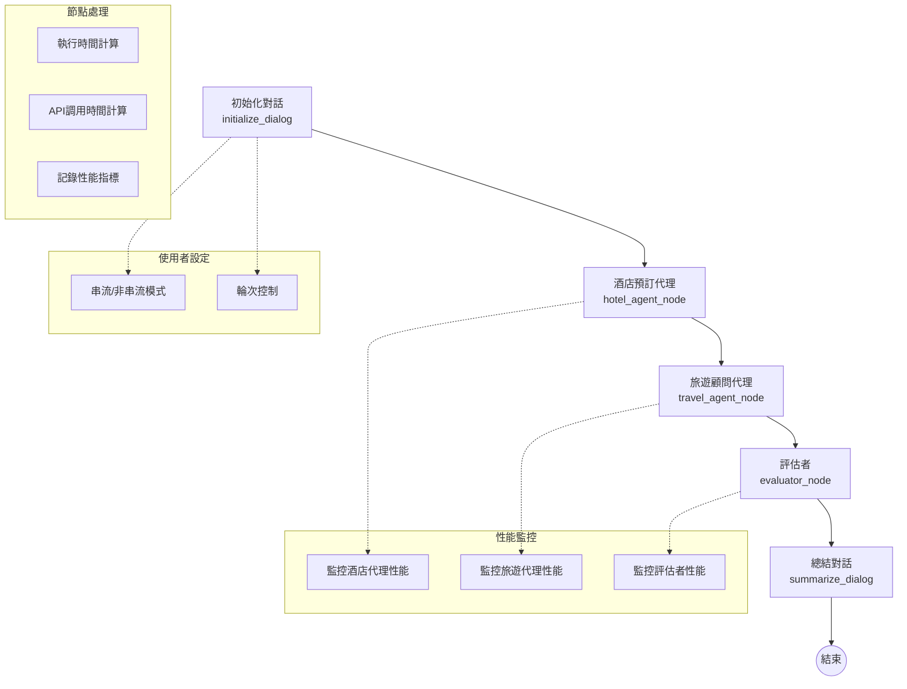

```mermaid
graph TD
    A[初始化對話<br/>initialize_dialog] --> B[酒店預訂代理<br/>hotel_agent_node]
    B --> C[旅遊顧問代理<br/>travel_agent_node]
    C --> D[評估者<br/>evaluator_node]
    D --> E[總結對話<br/>summarize_dialog]
    E --> F((結束))
  
    subgraph 性能監控
        PM1[監控酒店代理性能]
        PM2[監控旅遊代理性能]
        PM3[監控評估者性能]
    end
  
    B -.-> PM1
    C -.-> PM2
    D -.-> PM3
  
    subgraph 節點處理
        P1[執行時間計算]
        P2[API調用時間計算]
        P3[記錄性能指標]
    end
  
    subgraph 使用者設定
        S1[串流/非串流模式]
        S2[輪次控制]
    end
  
    A -.-> S1
    A -.-> S2
```
